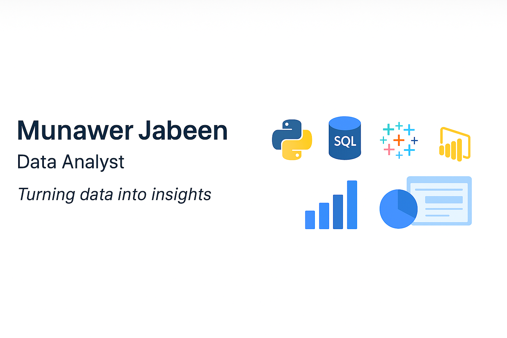

  

# Hi, I'm Munawer Jabeen 👋  

💡 Data Analyst passionate about **marketing & content analytics**.  
I specialize in using **Python, Excel, SQL, Tableau, and Power BI** to turn raw data into meaningful insights and dashboards.  

---

## 🧰 Skills  

  
  
  
  
  
  
   

---

## 🔭 Featured Projects  

### 🛍 [Vrinda Store Sales Dashboard (Excel)]  
   - Pivot tables, interactive dashboard, KPI cards  
   - **Key Insight:** Women purchase more, Amazon/Flipkart are top channels
 👉 [View Repo](https://github.com/Mjabeen164/Vrinda-Store-Sales-Dashboard)  

---

### 🍕 [Pizza Sales SQL Analysis]
   - SQL queries to find top-selling pizzas, peak order times  
   - **Key Insight:** Fridays and evenings had maximum demand
👉 [View Repo](https://github.com/Mjabeen164/Pizza-Sales-Project-SQL-)  

---

### 🚗 [Car Sales EDA (Python)] 
   - Pandas, Matplotlib for trend analysis  
   - **Key Insight:** Mileage and brand strongly influence price
👉 [View Repo](https://github.com/Mjabeen164/Vrinda-Store-Sales-Dashboard)  

  

---

### ⏱ [Fitness Tracker Data (Excel + Python)] 
   - Steps vs Calories correlation, activity by weekday  
   - **Key Insight:** Sedentary time dominated weekdays
👉 [View Repo](https://github.com/Mjabeen164/Vrinda-Store-Sales-Dashboard)  

 

---

### 🔭 [Exoplanet Visualization (Python + Seaborn)]  
   - Analysis & plots of exoplanet discovery trends: methods, orbital periods, system sizes  
   - **Key Insight:** Discovery methods changed over time; heavier exoplanets are rarer at large distances
👉 [View Repo](https://github.com/Mjabeen164/Exoplanet-Visualization-Python)
  

### 🍽️ Restaurant Data Analysis (Python + Tableau)  
Explored restaurant ratings, cuisines, table booking, and online delivery trends.  
👉 [View Repo](https://github.com/Mjabeen164/Restaurant-Data-Analysis-Marketing)  

  

---

### 🍴 Restaurant Orders (SQL Project)  
Analyzed a quarter’s worth of restaurant orders to find **most/least popular items, spending patterns, and cuisine trends**.  
👉 [View Repo](https://github.com/Mjabeen164/Restaurant-Orders-SQL-Analysis)  

---

### 🚀 Startup Analytics (Power BI Project)  
Analyzed **1000 startups dataset** to explore revenue vs expenses and top growth companies.  
👉 [View Repo](https://github.com/Mjabeen164/Startup-Analysis-Power-BI-Project-)  

  

---
### 🚀 Automated News Scraper 
  Automated BBC Tech News scraper with daily GitHub Actions updates.
👉 [View Repo](https://github.com/Mjabeen164/Automated-BBC-Tech-News)  

## 📬 Contact  
📧 **munawerjabeen703@gmail.com**  
🔗 [LinkedIn](https://www.linkedin.com/in/munawer-jabeen-900811380/)

---

## 📊 GitHub Stats  

  

  

  

